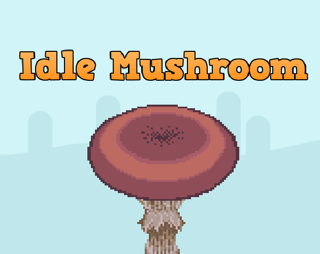
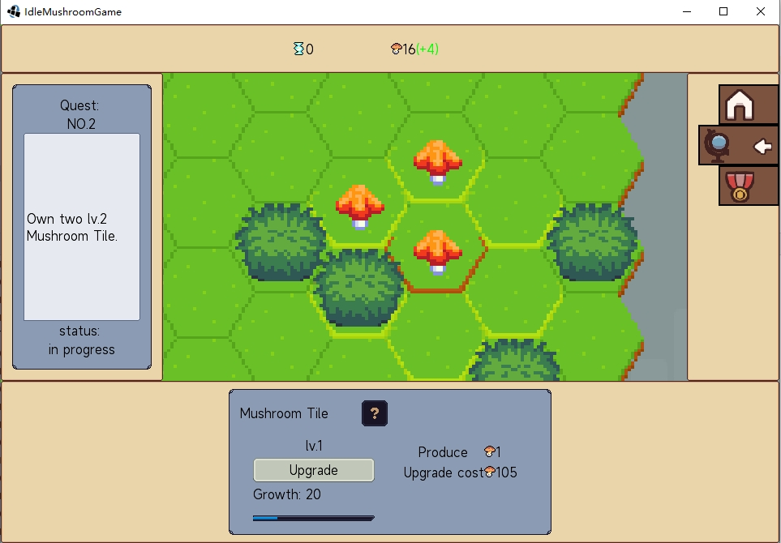
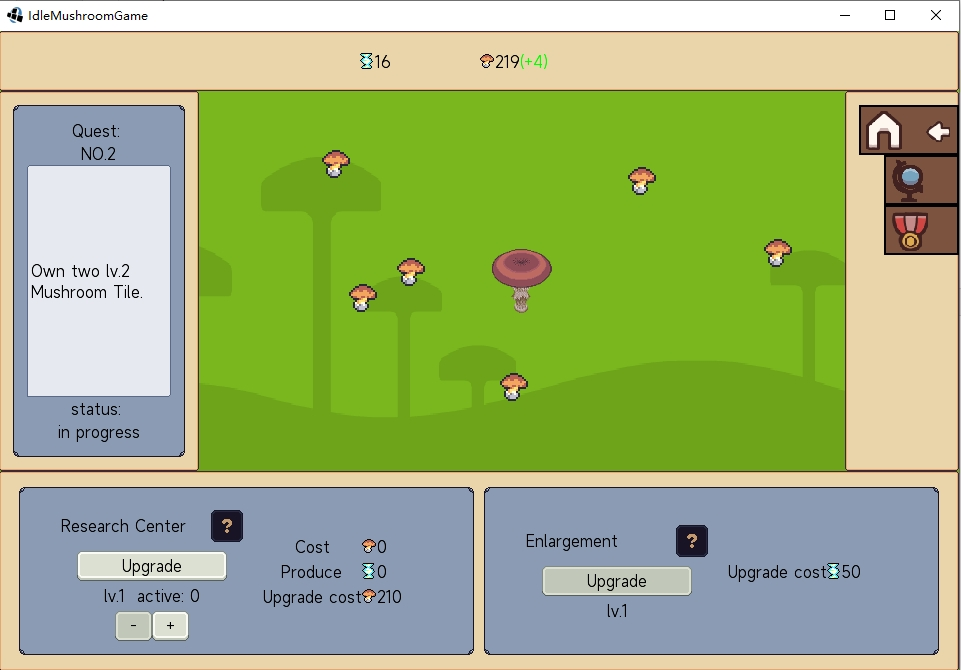
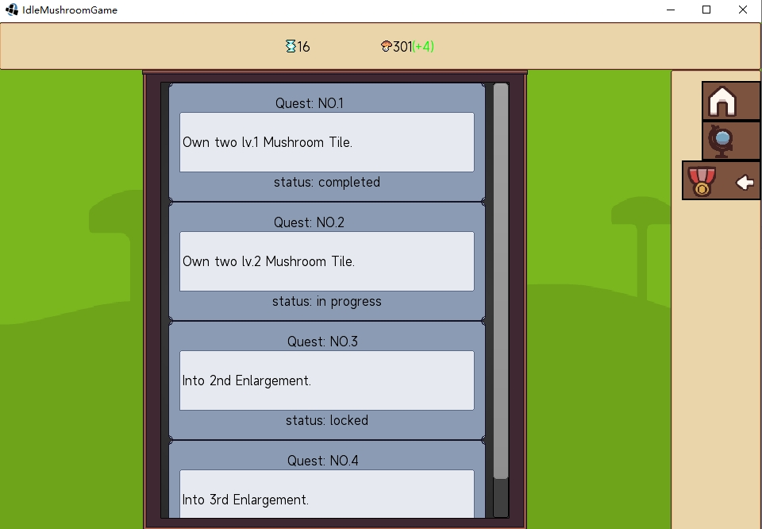

This project created in [game-off-2023](https://itch.io/jam/game-off-2023) for the theme `Scale`

## IdleMushroom

Idle game of mushroom in a tile-based world.

### release

Desktop: Run desktop-subproject java main.

Web: [Online play](https://hundun.itch.io/idle-mushroom)

### How to play

English introduction

- Clicking on the large mushroom in the center of the homepage grants mushroom resources.

- Hovering the mouse over the [?] icon in the game allows you to view relevant descriptions.

- The game automatically saves every ten seconds.

- As the game is in its early version, you may lose your saved files when there is a version update.

中文介绍

- 点击主页中央的大型蘑菇可获得蘑菇资源。

- 将鼠标悬浮在游戏中[?]图案上可查看相关介绍。

- 游戏每隔十秒自动存档。

- 游戏处于早期版本，当游戏发生版本更新时，你可能会丢失存档。

### Resources thanks

TODO

